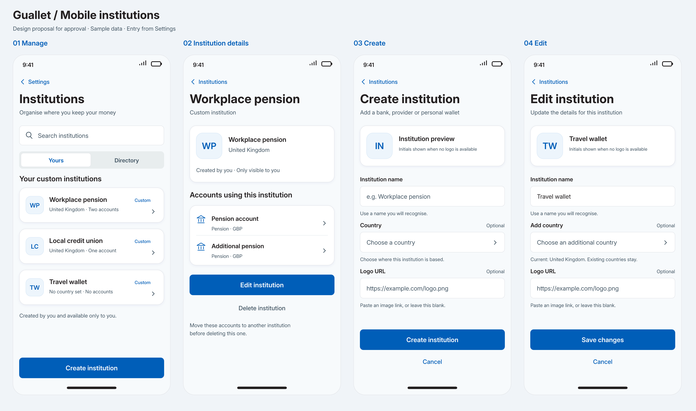
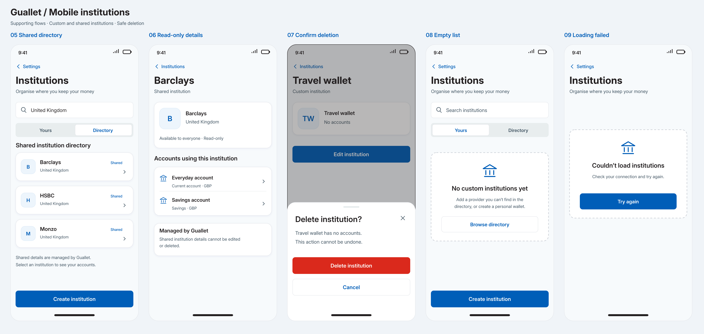

# Mobile institution management

Settings → Institutions opens a stack flow with a searchable Yours list,
shared Directory, institution details, and create/edit screens. It does not add
an app tab. Institution cards show countries, logos (or initials on failure) and
counts of the signed-in user's accounts. Detail rows open the existing account
screens.

## Approved design

These are approval mockups, not screenshots of a running native application.
The implementation uses native navigation headers and the current Luna theme.

Mobbin references:

- [Rocket Money](https://mobbin.com/screens/9000063d-7ae6-46ef-a087-e44eff9e1887)
  informed institution/account grouping.
- [ANZ Plus](https://mobbin.com/screens/453cc41e-f034-4c62-867b-1be5e2740aa6)
  informed logo-led cards and row hierarchy.

## Behaviour

- Yours contains user-owned institutions. Directory contains shared institutions
  with a null owner, and these cannot be edited or deleted.
- Search matches institution names, country codes and country names. Country
  selection supports the ISO alpha-2 list and a searchable Luna BottomSheet.
- Forms require a nonblank name and accept an optional HTTP(S) logo URL. A missing
  or failed image shows Unicode-aware initials. Editing can clear an existing
  logo by sending `image_src: null`.
- The existing country update contract is additive: Add country retains existing
  countries and the API deduplicates the new country. Clearing that selection
  means no additional country is sent.
- Unsaved form changes prompt before navigation. Submitting twice is prevented;
  save failures retain entered values. Successful saves open institution details.
- Account loading or refresh failures do not enable deletion. Moving associated
  accounts to another institution is required before deletion.
- A custom institution without accounts can be deleted after confirmation in a
  Luna BottomSheet. The API checks user-scoped account references and converts a
  foreign-key conflict (including an account attached during deletion) to HTTP 409. It does not delete accounts. Successful deletion returns to the list.
- First-load failure offers Retry; a failed refresh retains loaded institutions.
  Empty lists and searches offer a relevant next action.
- Controls have accessible names and selected/disabled states; forms scroll
  above the keyboard and controls accommodate larger text. New screens explicitly
  request safe-area edges from AppScreen, preserving existing screen defaults.

## API and cache contract

The institutions response now includes `user_id` and `countries`; deploy this API
change with the mobile feature. Client updates use PATCH `/institutions/:id`
(previously the hook incorrectly targeted accounts); deletes use DELETE on the
same resource. Create and update seed the detail cache and invalidate institution
queries. Delete removes the deleted detail cache and invalidates the list.

No schema migration is needed: ownership, countries and nullable image columns
already exist. Open banking's institution endpoint uses the same DTO mapping.

## Native build requirement

Forms use Luna's KeyboardAwareScrollView backed by
`react-native-keyboard-controller`. The app root includes KeyboardProvider and
Android uses resize keyboard layout. Rebuild iOS and Android development clients
and release binaries before distributing this feature; existing binaries cannot
receive the new native dependency through an OTA-only update. Use a new compatible
runtime/version when releasing it. Native deployment is outside this PR.

## Verification

Automated checks cover ownership separation, country searching, Unicode initials,
form validation, logo removal, HTTP methods and paths, mutation cache updates,
server permissions, account-protected deletion and foreign-key race handling.
Shared Luna tests cover native sheet dismissal and reopening.

Device verification still needs iOS and Android builds. Check:

- Settings entry, navigation and deep links; account links and shared read-only
  details.
- Create, edit, clear logo, add country, cancel and discard changes.
- Form visibility with first/last fields focused, smaller devices, larger text
  and iPad keyboards; save/cancel stay reachable by scrolling.
- Country sheet search with keyboard visible; selection, dismissal and reopening.
- VoiceOver/TalkBack control names, errors and selected states.
- Deletion with and without accounts, 409 conflict, success feedback, offline
  retry and missing/invalid institution ids.
