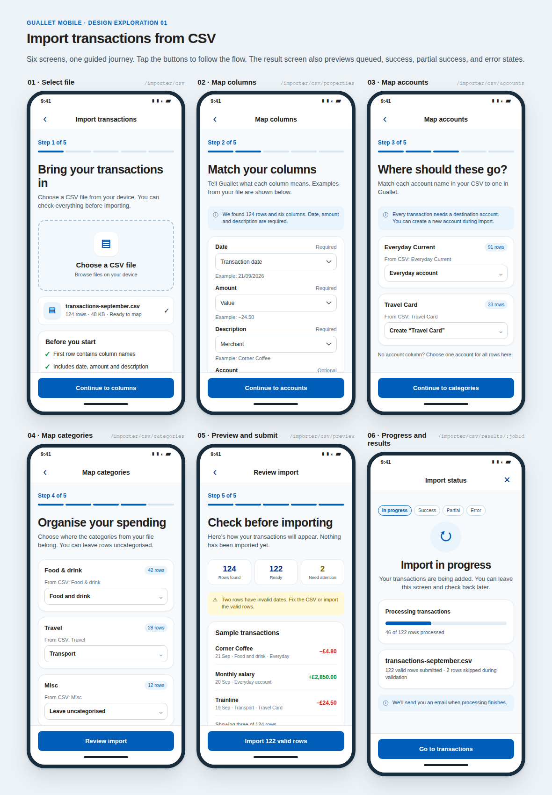

# CSV import mobile flow · V1

The Settings screen opens a five-step import wizard. After submission, a sixth
screen confirms that processing has started in the background.

[Open the editable HTML mockup](index.html).

The image captures the initial design exploration. Its sixth screen shows a
live progress concept; the current import flow uses the submission screen
described below. Live job tracking is covered by [issue #294](https://github.com/Guallet/monorepo/issues/294).

| Screen               | Route                      | Content and action                                                                                                                                                            |
| -------------------- | -------------------------- | ----------------------------------------------------------------------------------------------------------------------------------------------------------------------------- |
| 1. Select file       | `/importer/csv`            | Choose a CSV file from the device. Show the selected file and explain the header, required columns, and 5 MB limit. Continue to column mapping.                               |
| 2. Map columns       | `/importer/csv/properties` | Map required date, amount, and description columns. Account, category, and notes are optional. Show sample values from the file.                                              |
| 3. Map accounts      | `/importer/csv/accounts`   | Match each source account to an existing account or create one. If the file has no account column, choose one destination for all rows.                                       |
| 4. Map categories    | `/importer/csv/categories` | Match source categories to existing or new categories, or leave them uncategorised. Files without categories can proceed to review.                                           |
| 5. Review and submit | `/importer/csv/preview`    | Show row totals, validation errors, sample transactions, and destination accounts. Submit valid rows for background import.                                                   |
| 6. Import submitted  | `/importer/csv/submitted`  | Confirm processing has started. Show the file name and submitted/skipped row counts; explain that results arrive by email. Offer a path to Transactions and back to Settings. |

The submitted screen receives `fileName`, `submitted`, and `skipped` as optional
route parameters. The earlier wizard screens share the selected file and
mappings through the import draft rather than URL parameters.

## Design references

- [Expensify spreadsheet import](https://mobbin.com/flows/0c73a300-77c0-4d14-b72c-e6c98f79e160): field mapping.
- [Copilot Money import entry](https://mobbin.com/flows/02e73e3c-6caf-4fee-998a-a1df5b8e1e9e): Settings entry point.
- [Rocket Money review](https://mobbin.com/screens/fd12c9b6-0768-44c8-9540-090ec43c167e): separate transaction preview.

Layout, copy, and colours follow [Guallet's design system](../../../DESIGN.MD).
