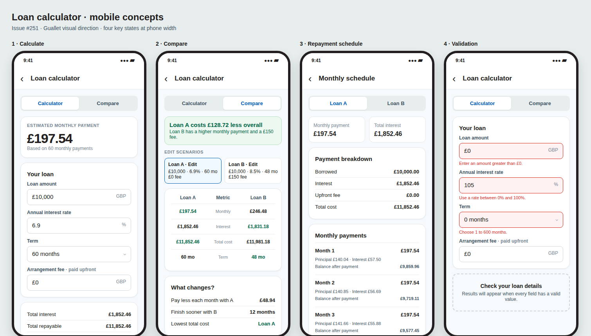

# Issue #251 · Mobile loan calculator

Open the [HTML mockup](./issue-251-loan-calculator-mobile.html) for a larger view. These are visual proposals, not implemented app screens.

## Mobbin research

- [Zopa Bank loan options](https://mobbin.com/screens/80cabd17-e5b9-45b4-a688-450445b8bf79) puts amount and term controls beside monthly payment, APR, and total repayable. The direct relationship between an input and its result supports a live calculator.
- [Zopa Bank cost breakdown](https://mobbin.com/screens/cd089915-53c2-48e8-b743-93023a16730b) makes the borrowed amount, interest, and total distinct. The proposed schedule repeats this structure before monthly rows.
- [Realtor.com monthly cost calculator](https://mobbin.com/screens/f731bd6a-d689-4f45-a8fe-610555d11ff1) anchors the monthly cost above editable assumptions. Guallet's proposal uses a prominent monthly payment at the top of the calculator.
- [Redfin rate comparison](https://mobbin.com/screens/4287cb71-597e-41b0-9f4a-6e730959a71a) shows the search criteria before comparing offers. Guallet's comparison keeps both scenario summaries above a compact metric table.
- [Wise fee comparison](https://mobbin.com/screens/583351db-e05e-4a34-aea0-8a568d1e91bb) uses aligned columns for a direct comparison. The proposed table keeps Loan A and Loan B in fixed columns and labels the metric between them.
- [Afterpay payment timeline](https://mobbin.com/screens/fba6f889-ea60-4b60-881f-a89dad25549f) shows instalments as readable dated rows. Guallet adapts the row format to month, payment, principal, interest, and remaining balance.

The patterns above are observations from those individual screens; this design is an original Guallet layout.

## Proposed flow

1. A **Tools** section in Settings contains a **Loan calculator** row. It opens a stack screen and preserves the app's five existing tabs.
2. **Calculator** shows a monthly payment immediately, then four editable fields and repayment totals. Values update after each valid edit. Money uses the user's default currency.
3. **Compare** shows two scenario summaries and a row comparison. Selecting **Edit** opens the corresponding four-field editor. The verdict is based on **total cost including the arrangement fee**. Lower monthly payment and shorter term are shown as separate tradeoffs.
4. **Monthly schedule** opens from calculator results. Loan A and Loan B can be switched at the top. Each month has a payment total, principal, interest, and remaining balance. Long schedules scroll or render in a virtualized list.
5. **Validation** stays inline with the field. While a field is empty or invalid, no misleading repayment result is shown. The form accepts a positive amount up to one trillion, a 0–100% rate, 1–600 whole months, and a nonnegative fee up to one trillion. Currency amounts and rates allow up to two decimal places. It also rejects combinations whose rounded monthly payment would not reduce the balance.

## Visual rules

- Use Luna mobile theme colours and spacing. White cards, a pale page background, blue controls, and green only for a cheaper value or positive saving follow `DESIGN.MD`.
- Use tabular numerals for all amounts. Arrangement fee is explicitly labelled as paid upfront; **total repayable** excludes it, while **total cost** includes it.
- Keep the results above the form so an input change is visible. Scrolling reveals all totals and the schedule link.
- The displayed example uses the shared calculator with a final instalment that clears the balance: Loan A is £10,000 at 6.9% for 60 months with no fee; Loan B is £10,000 at 8.5% for 48 months with a £150 fee. Loan A costs £128.72 less overall.

## Review decision

The main design choice is the comparison editor: these mockups use one scenario editor at a time and an always visible comparison summary. This avoids stacking two full forms before the result on a narrow phone.
