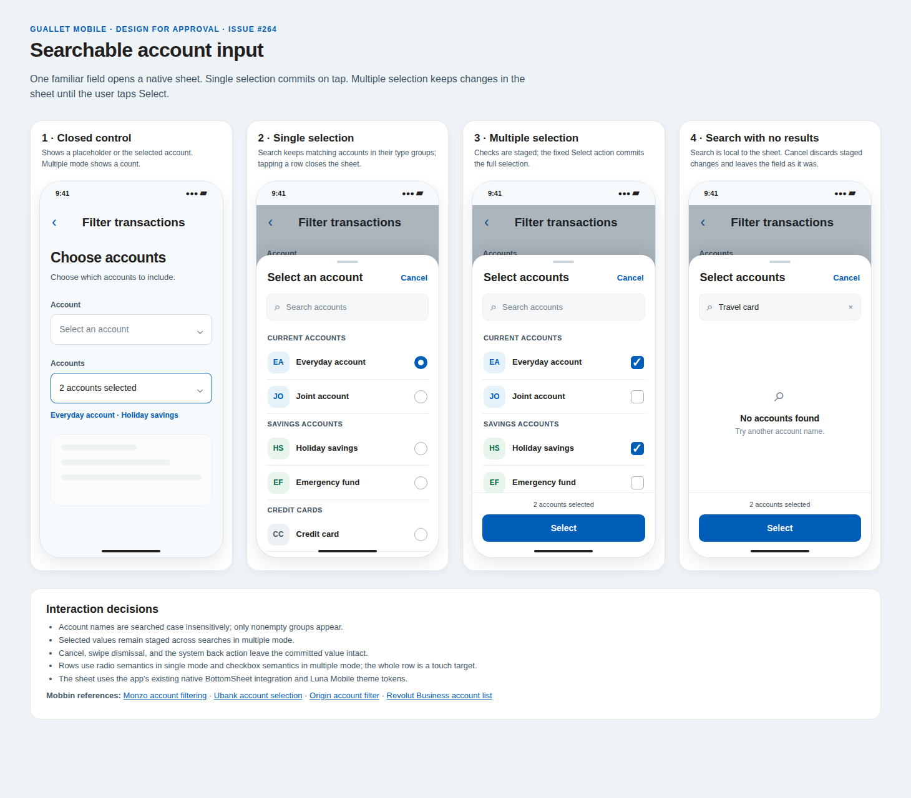

# Mobile AccountInput design

Approved design for [issue #264](https://github.com/Guallet/monorepo/issues/264).

## States

1. **Closed control:** Show the placeholder, selected account name, or selected account count.
2. **Single selection:** Open a native sheet with search and grouped accounts. Tapping a row commits the account and closes the sheet.
3. **Multiple selection:** Show staged checks and a fixed **Select** action. Tapping Select commits the full selection.
4. **No search results:** Keep the search field and staged selection visible, with a clear empty message.

## Interaction details

- Search account names locally without case sensitivity. Keep matching results grouped by account type and hide empty groups.
- Preserve staged multiple selections while the search query changes.
- Cancel, sheet dismissal, and system back leave the committed value unchanged and call `onCancel` when provided.
- Use radio semantics for single selection and checkbox semantics for multiple selection. The whole account row is a touch target.
- Use the existing app native BottomSheet integration and Luna Mobile theme tokens.

## Mobbin references

- [Monzo account filtering](https://mobbin.com/flows/65dfb893-5351-410c-bfe4-d615e396e84f)
- [Ubank account selection](https://mobbin.com/flows/4830a8d1-9192-47bf-ac55-95145da103c8)
- [Origin account filter](https://mobbin.com/screens/a2ef8913-cf5e-4e54-a211-538210e971a3)
- [Revolut Business account list](https://mobbin.com/screens/0e471522-7ff4-4bda-816c-8d5f1ef38ed4)
