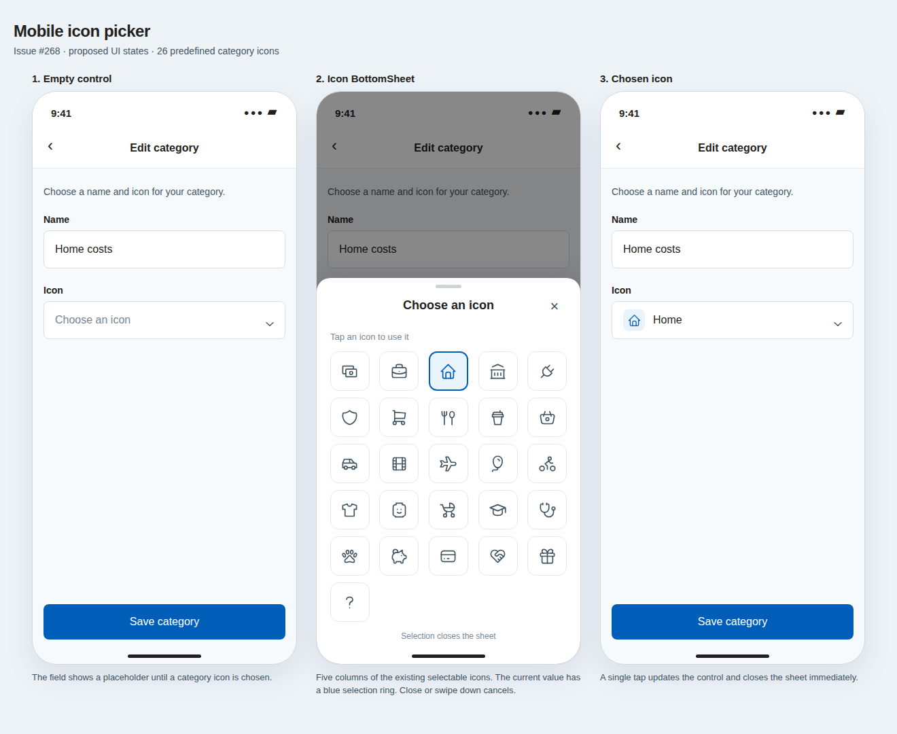

# Mobile icon picker · issue #268

[Open the HTML design source](./issue-268-icon-picker.html).

## States

1. **Empty control:** Show “Choose an icon” until a category icon is selected.
2. **BottomSheet:** Show the shared set of 26 predefined category icons in a five column grid. Mark the current selection with a blue outline and pale blue fill.
3. **Chosen icon:** Show the icon and its readable name in the closed control.

## Behaviour

- Tap an icon to select it and close the BottomSheet immediately.
- Close or swipe down without selecting to cancel.
- Keep the grid scrollable on smaller screens.

## References

- [Rocket Money category icon sheet](https://mobbin.com/screens/b90e2d1d-7bc2-4586-875f-960995d8082d)
- [Origin category icon grid](https://mobbin.com/screens/f0b36747-5d0f-4659-b6de-994bec10e910)
