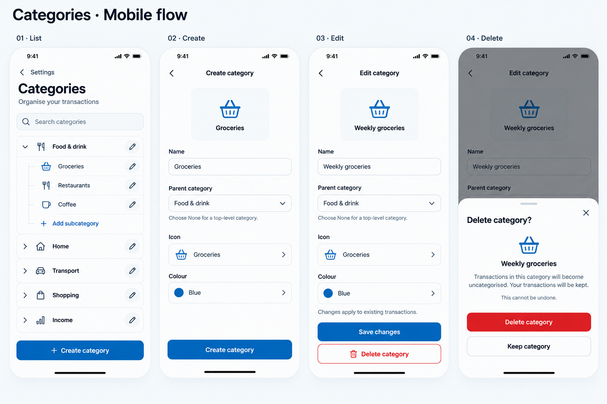

# Mobile category management — proposal for approval

Status: **Approved and implemented.** Entry point: Settings → Categories → Manage categories.

## Flow

Enter through **Settings → Categories**. The management screen is a stack screen,
with a back button to Settings.

| Action             | Interaction                                                 | Result                                                                      |
| ------------------ | ----------------------------------------------------------- | --------------------------------------------------------------------------- |
| List               | Search names; expand or collapse a parent using its chevron | Show parent categories and indented subcategories                           |
| Create             | Tap Create category                                         | Open an empty full-page form                                                |
| Create subcategory | Tap Add subcategory inside an expanded parent               | Open the form with that parent selected                                     |
| Edit               | Tap a category row or its separate pencil button            | Open the same form with existing values                                     |
| Save               | Tap Create category or Save changes                         | Return to the list, reveal the saved category, show a brief success message |
| Delete             | Tap Delete category on the edit screen                      | Open the confirmation sheet                                                 |
| Confirm delete     | Tap the red Delete category button                          | Return to the list after the request succeeds; show Category deleted        |
| Cancel delete      | Tap Keep category, close, or dismiss the sheet              | Return to the edit screen with the category retained                        |

The create screen in the board shows an example of a filled form. A new form
starts with a blank name, parent None, and sensible default icon and colour.
The illustration shows representative category data rather than a required
seed list.

## Forms and supporting pickers

- Fields: name, parent category, icon, colour. No new income/expense type field.
- Live preview updates with the draft name, icon, and colour.
- Parent None means a top-level category. Selecting a parent creates a
  subcategory. Use a searchable shared category sheet; exclude the current
  category and its descendants.
- Keep the existing two-level category hierarchy. A parent with children cannot
  itself be moved beneath another parent; explain that its children must be
  moved first.
- Reuse the existing Luna mobile IconPicker and ColorPicker. Their sheets are
  secondary to the full-page form and close after choosing a value. Close or
  swipe down without selecting keeps the previous value.
- The previously documented [icon picker mock](./issue-268-icon-picker.md) and
  [colour picker options](./issue-269-color-picker-options.png) provide the
  supporting visual references. Category colours come from the shared picker;
  the main board uses blue examples.
- Separate expand and edit touch targets; minimum 44-point touch targets.
  Give icon controls readable accessibility labels.
- The form scrolls with the keyboard; keep the action accessible above the
  keyboard and respect safe areas.

## Deletion policy proposed for approval

**Leaf category:** “Transactions in this category will become uncategorised.
Your transactions will be kept.” Follow with “This cannot be undone.”

**Parent with subcategories:** replace the destructive confirmation with
“Move or delete the subcategories in this category first.”
Show a Keep category button; do not offer a cascading delete.

Deletion only closes the edit screen once successful. On failure, keep the
category and sheet visible and show an actionable error. No undo is promised.

The API enforces the parent-category policy and serializes hierarchy changes
per user. It also blocks deletion of categories referenced by budgets or rules,
with an actionable message to remove or update those references first. Leaf
deletion preserves transactions and clears their category assignment.

Moving a subcategory to None clears both parent mappings. Shared query hooks
refresh the category list and affected transaction/budget caches after changes.
The implementation reuses Luna’s bottom sheets, icon picker, and colour picker;
the colour picker uses theme presets and retains an existing custom colour.

## Additional states

| State             | UI                                                                                                                     |
| ----------------- | ---------------------------------------------------------------------------------------------------------------------- |
| Loading list      | Skeleton rows; avoid flashing the empty state                                                                          |
| Empty list        | Category line icon, “No categories yet”, “Create your first category to organise transactions”, Create category button |
| No search results | “No categories found”, Clear search action; keep Create category accessible                                            |
| Load failure      | “Couldn’t load categories”, Try again                                                                                  |
| Blank name        | Inline “Enter a category name”; block save                                                                             |
| Unchanged edit    | Disable Save changes                                                                                                   |
| Saving/deleting   | Progress on the action; prevent repeated submissions                                                                   |
| Save failure      | Keep draft values; show “Couldn’t save category. Try again.”                                                           |
| Unsaved exit      | Confirm “Discard changes?” with Keep editing and Discard changes                                                       |

Success messages use “Category created”, “Category updated”, and
“Category deleted”. Preserve list search and expansion on return, and expand
a saved category’s parent as needed.

## Mobbin references

- [Origin — Creating a categories](https://mobbin.com/flows/79ef7a8e-dcb5-4f91-a622-4c775e9caeed):
  category rows, a focused category form with name/icon/colour choices, and
  success feedback. Guallet uses a full-page form to accommodate its existing
  sheets and keyboard.
- [Buddy — Edit categories](https://mobbin.com/flows/6e144b78-8c78-4d6d-83ea-732225d53300):
  grouped parent/subcategory management. Guallet separates expansion from
  editing and places deletion in the edit form.
- [Rocket Money — Delete category confirmation](https://mobbin.com/screens/f0a627c7-3010-4219-a19d-74230f3e0e2d):
  a confirmation over the edit screen that explains consequences.
  Guallet’s proposed transaction outcome is uncategorised rather than
  Rocket Money’s reset-to-original-category behavior.

These are pattern references, not screenshots reproduced in the mock.
The mock follows [Guallet’s design guidance](../../DESIGN.MD).

## Generation

Created with the built-in imagegen tool.
The [generation prompt](./mobile-category-management-prompt.md) records the
full visual brief. The image is an approval mock; native components and exact
token values will govern implementation after approval.
