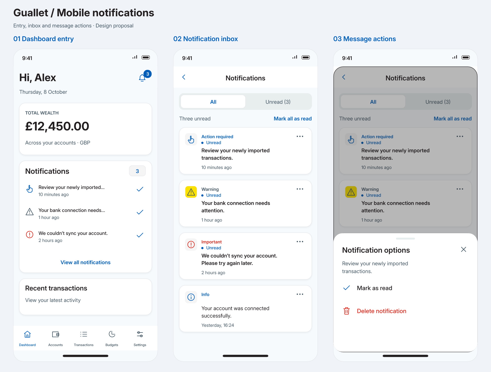
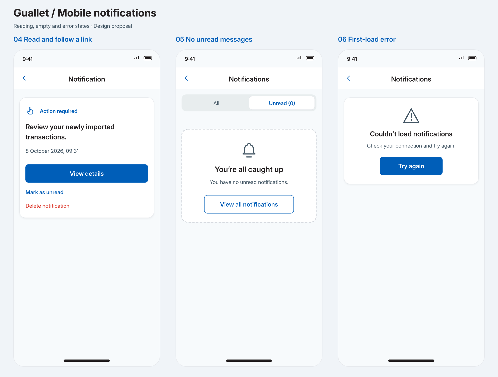

# Mobile notifications design proposal

Status: approved and implemented. See [mobile notifications](../../apps/mobile/docs/notifications.md) for implementation behaviour and validation. Original Guallet
artwork based on inspected Mobbin screens and the existing web notification
feature. Sample messages and the dashboard balance are fictional.

## Mobbin references and design choices

- [Todoist notification inbox](https://mobbin.com/screens/a7496fff-3df8-4127-9ccf-d7c479cf7ffe):
  All/Unread segmented control and a compact notification surface. Adapted to
  a full stack screen with Guallet cards; unread count is visible in the tab.
- [Glassdoor notifications](https://mobbin.com/screens/d3bced26-b626-4285-bfbc-c9b0aaf300be):
  small unread dot, leading icon and message/time hierarchy. Guallet adds an
  explicit Unread label so status does not depend on colour.
- [PayPal notification options](https://mobbin.com/screens/f30df958-ed03-4614-a5cd-f9635b3d0396):
  compact bottom sheet with a close control and a readable action label.
  Guallet uses this pattern for individual read/unread and delete actions.
- [Spotify notification actions](https://mobbin.com/screens/d6532a1a-7df7-42d7-b28f-9abe8d066edb):
  notification preview above a delete action in a bottom sheet. Retain that
  message context so users can see which notification they are managing.

## Web feature parity

| Existing web capability                   | Proposed mobile experience                                                                                         |
| ----------------------------------------- | ------------------------------------------------------------------------------------------------------------------ |
| Header unread indicator                   | Dashboard bell with count; hide count at zero; 99+ for large counts                                                |
| Header preview and dashboard widget       | Dashboard card showing up to three newest unread messages; inline mark-as-read controls and View all notifications |
| Complete notification history             | Dedicated Notifications stack screen, newest first; All selected on entry                                          |
| Unread messages                           | Unread tab, derived from the same notification list                                                                |
| Info, Warning, Important, Action required | Type label plus Luna outline icon; neutral/blue, yellow with dark icon, red, and blue respectively                 |
| Read/unread per notification              | Row ellipsis opens Notification options; show Mark as read or Mark as unread according to state                    |
| Mark all as read                          | Text action above the list when unread count is positive; operates across the full inbox                           |
| Delete one notification                   | Red Delete notification action in the options sheet and detail view                                                |
| Open linked destination                   | Readable detail screen with View details for a validated, supported mobile destination                             |
| Loading and empty feedback                | Skeleton cards, separate All/Unread empty copy, retry states                                                       |

All/Unread filtering and a readable detail view are proposed mobile adaptations.
The detail view deliberately adds a step before following a destination so long
messages and unsupported links remain usable.

## Entry and reading

The dashboard bell and View all notifications both open the full inbox.
Keep the existing five main tabs. The notification stack has a native back
control and no tab bar; preserve the inbox filter and scroll position on return.
The dashboard preview supplements the bell and sits below the wealth summary;
retain the existing income/expense widgets in the final dashboard layout.

Tapping a message opens its full, untruncated content and marks it as read.
The same action applies to dashboard previews. A notification consists of its
message, type, timestamp and optional link; do not invent a notification title
or separate body field. Display relative time in lists and the exact local date
and time in the detail view. Opening options alone does not mark a message read.

If a message has a supported action, show View details. If it has no action,
omit the button. If its action is unsupported, omit the button and show:
“Page unavailable in the app” and “You can still read and manage this
notification here.” Do not silently open a different page. A navigation failure
shows “Couldn’t open this page. Please try again.” and keeps the message visible.

## Managing notifications

Use the shared Luna BottomSheet with title Notification options and its own
close control. Sheet content contains the message preview and two full-width
rows, at least 48 points tall. Closing by native dismissal or the close control
returns to the same list without changing read state. No swipe gesture is
required to discover an action.

Mark as read/unread updates the count, preview and both inbox tabs together.
A newly read message disappears from Unread after success. Keep the selected
tab even if the resulting list is empty. Mark all as read has no confirmation;
show progress and prevent duplicate submission. After success announce
“All notifications marked as read”.

Deletion requires an explicit confirmation: “Delete notification?” /
“This notification will be permanently removed.” with Cancel and Delete.
This is a proposed protection for the mobile destructive action; it does not
require a backend change. No undo is offered because the API has no restore
endpoint. On success close the sheet, update all lists and counts, and return
from a deleted detail view to the inbox. On failure keep the message and show
“Couldn’t delete the notification. Please try again.”

A failed read-state change retains or restores the previous state and count.
Use “Couldn’t update the notification. Please try again.” Disable only affected
controls while their operation is pending; bulk updates temporarily disable
read-state controls. Provide feedback for dashboard inline actions too.

## Remaining states and accessibility

- First load: three skeleton cards; do not show a false zero count or empty
  state while fetching. Dashboard preview uses its own loading placeholder.
- All empty: “No notifications yet” / “Your notifications will appear here.”
  No mark-all action. The bell remains available without a badge.
- Unread empty: “You’re all caught up” / “You have no unread notifications.”
  View all notifications selects All. Dashboard preview uses the same short
  empty copy and keeps View all notifications.
- First-load failure: “Couldn’t load notifications” with Try again. An unread
  query failure must not masquerade as zero unread messages.
- Refresh failure: retain cached content and the filter; show a small retry
  banner. Pull to refresh the list; refresh on returning to the foreground.
- Long messages: two-line preview with ellipsis on dashboard; inbox cards
  expand as needed. The detail always displays the full message.
- Minimum 44-point hit areas for bell, ellipsis, close and inline check controls;
  48-point sheet rows and primary buttons. Cards grow with larger text; controls
  wrap rather than overlap. No fixed-height production cards.
- Screen-reader labels include type, message, unread/read status and timestamp.
  Label the ellipsis “Options for [message]” and the check “Mark as read”.
  Announce successful mutations, focus the sheet on opening, restore focus to
  its trigger on closing and respect reduced motion.

## Implementation findings

Existing API client and React hooks already provide list, unread list, individual
lookup, read-state updates, mark-all-read and deletion. Reuse that type chain.
The API returns newest messages first. No notification creation UI is needed.

Backend notifications currently include `/transactions/inbox`, but the mobile
route tree has no equivalent. Define an explicit web-to-mobile destination map
and fall back to the detail screen for unsupported actions. Never cast arbitrary
server strings directly into Expo Router destinations. The existing unread hook
polls every five minutes; include app-foreground refresh and shared cache updates
when implementing the badge and list.

This proposal covers the existing in-app notification centre. Push permission,
device tokens and delivery preferences would require a separate product and
backend scope; the reviewed web UI does not supply these features.

Use Luna mobile theme tokens, shared BottomSheet, platform Luna icons, 16-point
card radii, hairline borders and subtle shadows. Preserve readable contrast for
read messages rather than applying opacity to the whole card. Follow DESIGN.MD
for production styling; format any money in product-owned copy with Money.format().

## Artwork

The boards are static design reference artwork. PNG previews and editable SVG
boards are stored beside this document. Production keeps the existing main tab
navigation and applies the approved layout to live notification data.
