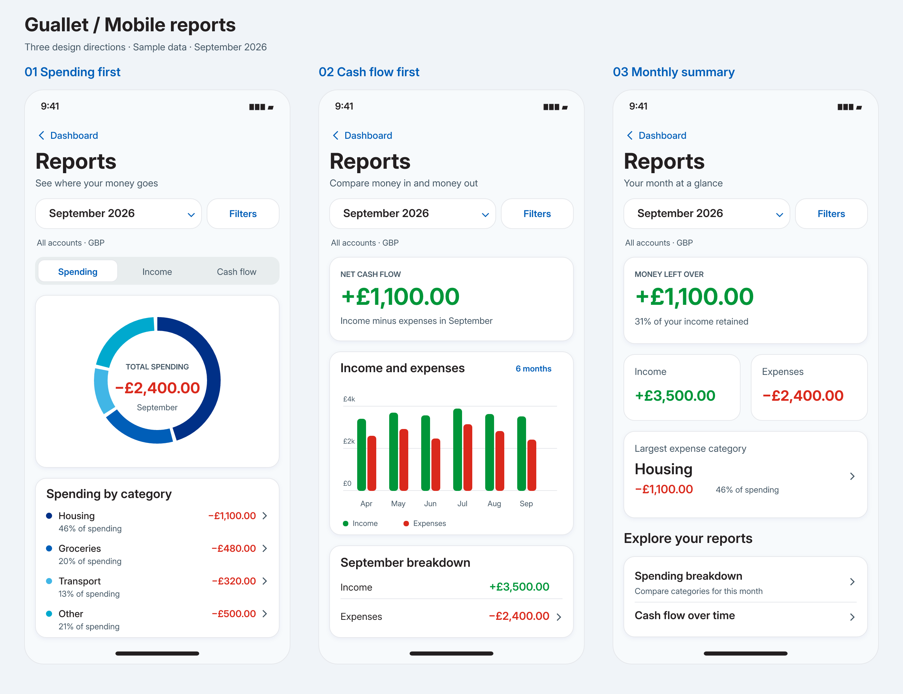
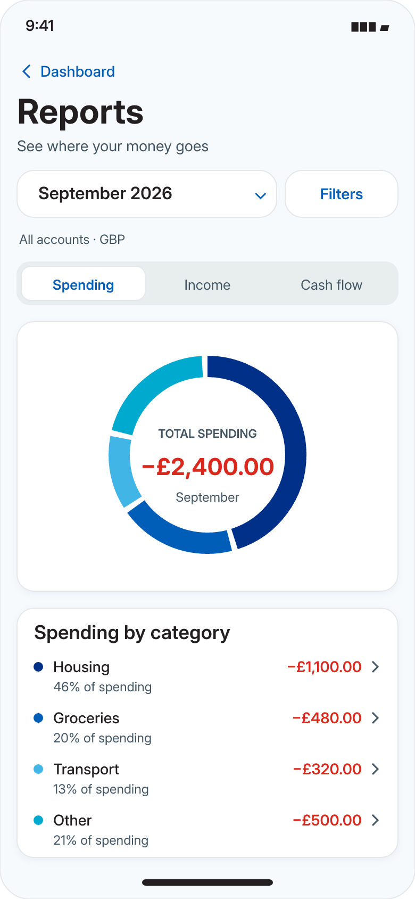
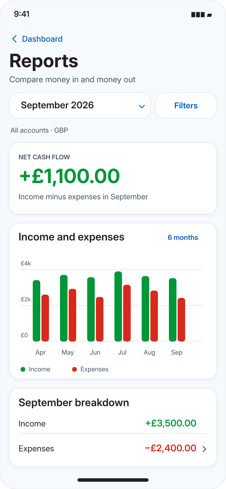
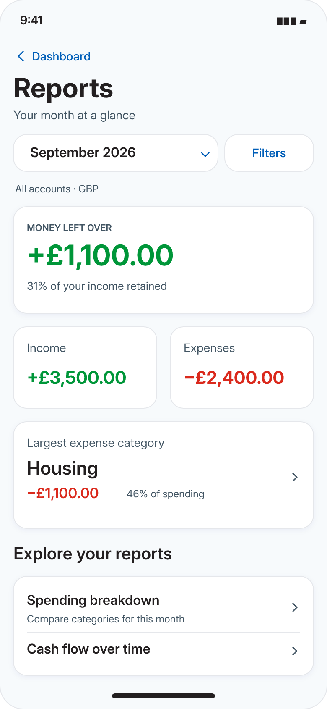

# Mobile reports: design approval

Three original Guallet concepts informed by Mobbin references. **Concept 1 was
approved** and is implemented in the mobile reports feature. These are static
approval mockups. All amounts are
fictional and describe a completed month, September 2026, in GBP.

## 1. Spending first

A donut chart answers “Where did my money go?” immediately. Spending, income,
and cash flow share a segmented control. Category rows show the amount and share
of spending; tapping a parent opens its subcategory breakdown with the same
month and filters. The donut uses cool category colours; signed expense amounts
remain red. Percentages and labels make the chart readable without colour.

Inspired by the total-in-ring and category-list arrangement in
[Revolut on Mobbin](https://mobbin.com/screens/56d80261-ebab-49c4-aa2c-de9e23c41abb).
Guallet uses its own light surfaces and blue palette.

Best for understanding spending categories. Tradeoff: income and cash flow
require switching the selected report.

## 2. Cash flow first — recommended

A prominent net cash-flow amount sits above paired income and expense bars.
The selected month has an explicit breakdown below. Tap a month to update the
summary; tap Income or Expenses to open the relevant category breakdown. A
long-press on a bar shows its exact amount and month. Chart controls support
six months and a full year. Provide an accessible month/value list as an
alternative to chart gestures.

Inspired by the comparison chart and total-summary card in
[Origin on Mobbin](https://mobbin.com/screens/4f459cea-bf63-4e88-8628-a9cb8cdfafd2).
Guallet applies consistent green income and red expense semantics.

Best for comparing income with expenses and understanding change over time.
It is the clearest starting point for the existing cash-flow report domain.
Tradeoff: category composition sits one level deeper.

## 3. Monthly summary

A compact summary answers “How did this month go?” with money left over,
income, expenses, and the largest expense category. Dedicated report rows lead
to spending composition or cash flow. Tapping the largest category opens its
subcategory breakdown. Summary cards offer a reading path with little chart
interpretation.

Inspired by the income, expense and net cash-flow summary above a separate
category-breakdown card in
[Origin on Mobbin](https://mobbin.com/screens/ffff5f8c-16be-423b-9387-193ed251fb63).
Guallet separates the overview from detailed reports.

Best for a quick monthly review and room for future report types. Tradeoff:
charts require opening a report.

## Shared interaction decisions

- Entry: a Reports shortcut from Dashboard; Reports is a stack screen with a
  back link. The existing five-tab navigation stays as the context for entry.
- Month selector: previous/next month and a month/year picker, using the shared
  Luna BottomSheet. Default to the latest completed month; explicitly label a
  current-month selection as “Month to date”.
- Filters: shared Luna BottomSheet containing accounts and categories, with
  Apply and Reset. Show the active selection and count after applying filters.
- Currency: this artwork assumes all selected accounts are GBP. Mixed-currency
  totals must be separated by currency until an explicit conversion policy exists.
- Drilldown: retain month, currency and filters; show parent category totals and
  children without counting the parent and its children twice. Include untagged
  transactions and a text alternative for every chart.
- Loading: skeletons in summary and chart cards. Empty: “No transactions in
  this period” with Change period and Reset filters. Error: “Couldn’t load your
  report” with Try again. Keep applied selections on retry.
- Accessibility: minimum 44-point touch targets, labels and values alongside
  colour, screen-reader chart summaries, and layouts that adapt to larger text.
- Production: theme tokens, Luna icons, Money.format(), tabular numerals,
  sentence-case labels, 16-point card radii, borders and subtle shadows.

## Data findings during design review

The yearly API client accepts account/category/date filters, but its controller
and service only implement the year argument. The response contains **net**
monthly category values, without currency identifiers or separate gross income
and expense totals. A category can contain both positive and negative entries,
so gross totals cannot safely be reconstructed from the sign of its net value.

Implementing these concepts requires reliable income/expense aggregates,
currency handling, and functional filter support. Define treatment of transfers
and refunds before presenting totals or the retained-income percentage. Category
drilldowns can use the existing parent/subcategory structure once these totals
are reliable. Do not label money left over as savings or an account balance.

The implementation adds a separate monthly contract to address these gaps; see
[mobile reports](../../apps/mobile/docs/reports.md) for its behavior and validation.
The SVG originals are stored beside the PNGs for further revision.

To regenerate the review artwork, install `@resvg/resvg-js` in
`/tmp/guallet-reports-render`, then run
`node docs/mockups/mobile-reports-concepts.mjs` from the repository root.
